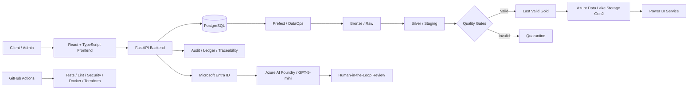
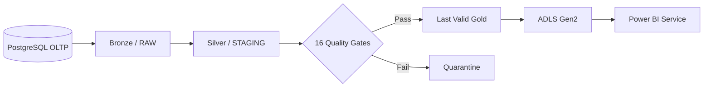
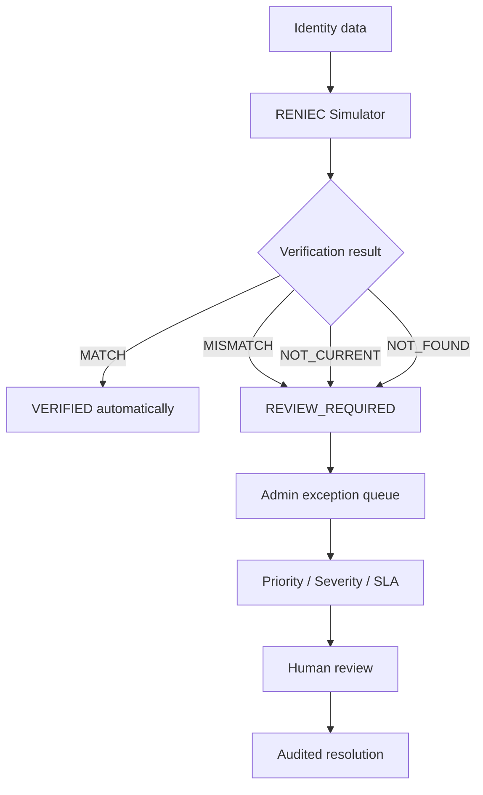
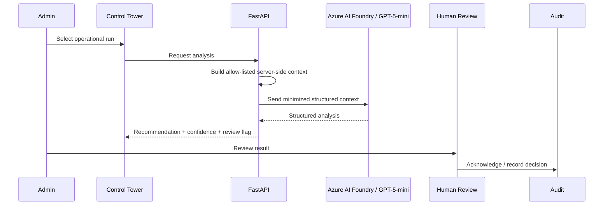
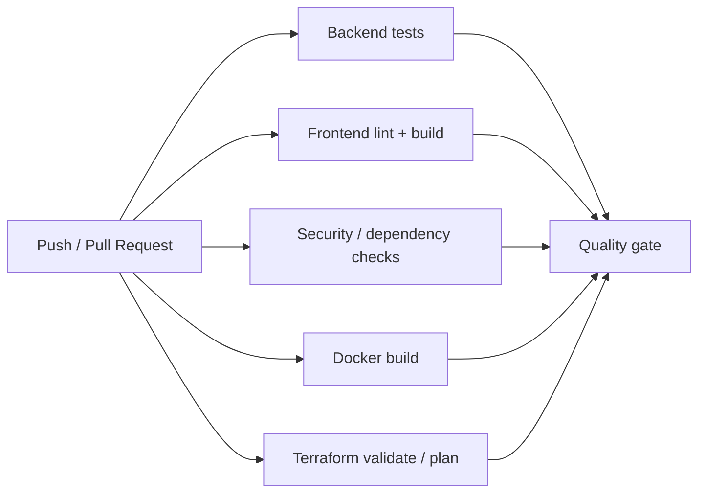

# TRAZA — Banking Operations & Data Traceability Platform

TRAZA is an academic portfolio project that models a modern banking operations platform with a strong focus on **transactional integrity, end-to-end traceability, governed DataOps, cloud analytics, identity verification, DevSecOps, and Human-in-the-Loop AI**.

The project was designed to answer a practical question:

> How can a digital banking operation be executed once, remain financially consistent, be fully traceable, feed reliable analytics, isolate defective data, and still preserve human oversight for sensitive decisions?

This public repository is a **clean portfolio snapshot** of the final implementation. It uses synthetic data and is not intended for production banking use.

---

## Key capabilities

- Customer and administrator web experiences.
- Authentication, authorization, ownership checks, and role-based access control.
- Accounts, deposits, withdrawals, transfers, cards, credit applications, loans, disbursement, and repayment schedules.
- Idempotent transaction processing and concurrency controls.
- Double-entry-style ledger validation and reconciliation.
- End-to-end operational traceability with `operation_id`.
- DataOps lineage using `run_id` and `batch_id`.
- Bronze / Silver / Gold processing with Quality Gates and Quarantine.
- Last Valid Gold pattern to protect analytics from invalid data.
- Controlled analytical publication to Azure Data Lake Storage Gen2.
- Power BI analytics over the curated cloud layer.
- Deterministic STP onboarding with exception routing.
- RENIEC-style identity verification simulator using synthetic identities.
- Operational Copilot based on Azure AI Foundry / GPT-5-mini.
- Human-in-the-Loop review for sensitive AI-assisted analysis.
- Microsoft Entra ID and Managed Identity for cloud workload authentication.
- Docker-based local services.
- Terraform validation for Infrastructure as Code.
- GitHub Actions CI with backend, frontend, security, container, and Terraform checks.

---

## Architecture



The architecture is intentionally hybrid: the transactional core and authoritative operational data remain separated from the analytical cloud layer. The cloud side complements the platform with hosted services, AI, and analytics rather than replacing the transactional authority.

---

## End-to-end traceability

A central design goal is being able to explain what happened to a banking operation across operational and analytical layers.

```text
operation_id
    ↓
movements
    ↓
ledger
    ↓
audit trail
    ↓
run_id
    ↓
batch_id
    ↓
Last Valid Gold
    ↓
ADLS Gen2
    ↓
Power BI
```

- `operation_id` identifies the banking operation.
- `run_id` identifies the DataOps pipeline execution that processed the data.
- `batch_id` identifies the analytical batch published as a valid Gold version.

This provides a traceable path from the original transaction to its analytical representation.

---

## Transactional integrity

The banking flow was designed around the following controls:

- idempotency to prevent duplicate processing;
- validation of account ownership and business rules;
- controlled concurrency;
- balanced ledger entries;
- financial reconciliation;
- persistent audit events;
- traceable operation identifiers;
- explicit rejection paths for invalid or inconsistent operations.

Validated scenarios include deposits, withdrawals, internal transfers, third-party transfers, controlled interbank flows, loan approval/disbursement, and balance updates.

---

## DataOps and Last Valid Gold

The DataOps pipeline transforms operational data into a controlled analytical layer.



### Design principles

- Invalid data is isolated instead of silently promoted.
- Analytical consumers read from a validated Gold layer.
- A failed pipeline run does not invalidate the previously approved Gold dataset.
- Historical Quarantine records remain auditable.
- Publication to ADLS is controlled and decoupled from the OLTP workload.

The final implementation validated all **16/16 Quality Gates** for the active Gold publication path.

---

## Deterministic STP onboarding

The onboarding flow follows a deterministic Straight-Through Processing strategy.



Sensitive identity decisions are **not delegated to the LLM**. The STP flow uses deterministic rules, while exception handling remains under human control.

Implemented exception-management capabilities include priority and severity, SLA tracking, assignment and reassignment, evidence validation, exception closure, staff/system audit events, reverification, and idempotent assignment behavior.

The backend regression suite reached **67/67 passing tests** after the STP implementation.

---

## Operational Copilot + Human-in-the-Loop

The Operational Copilot helps an administrator interpret operational exceptions without giving the model authority to execute banking decisions.



### AI governance controls

- server-side context construction;
- allow-list of permitted fields;
- minimized data sent to the model;
- structured model output;
- correlation identifier for traceability;
- mandatory human review where required;
- audit event for reviewed analyses;
- no autonomous identity approval;
- no autonomous movement of funds;
- no autonomous loan approval.

---

## Cloud architecture

The project validates a cloud deployment path using Microsoft Azure components such as Azure App Service, Azure Database for PostgreSQL, Microsoft Entra ID, Managed Identity, Azure AI Foundry, GPT-5-mini, Azure Data Lake Storage Gen2, and Power BI Service.

Managed Identity was used for workload authentication toward AI services, avoiding hardcoded model API keys in the application.

---

## Analytics with Power BI

The analytical layer includes dashboards focused on operations/executive summary, risk and delinquency, profitability, and DataOps quality/resilience.

The final Power BI model consumes the curated ADLS layer using organizational OAuth authentication, which decouples dashboard refresh from the local development workstation.

The Power BI report artifact is intentionally excluded from the public repository. The repository documents the ADLS-to-Power-BI architecture and analytical model without distributing the PBIX binary.

---

## DevSecOps and Infrastructure as Code

The repository includes a GitHub Actions workflow that validates multiple quality dimensions before promotion.



The pipeline is intentionally designed with a controlled promotion approach rather than unrestricted automatic production deployment.

---

## Security approach

Implemented or validated controls include authentication, role-based authorization, ownership checks, idempotency, auditability, transaction reconciliation, data minimization for GenAI, separation between deterministic rules and AI assistance, secrets outside source control, Entra ID / Managed Identity for cloud workloads, and CI security checks.

Enterprise hardening opportunities include Azure Key Vault, Application Insights, Log Analytics, VNet integration, Private Link, Front Door + WAF, SIEM integration, and disaster recovery/multi-region design according to RTO/RPO.

These are future enterprise evolution items rather than claimed as already implemented.

---

## Technology stack

| Layer | Technologies |
|---|---|
| Frontend | React, TypeScript, Vite |
| Backend | Python, FastAPI |
| Database | PostgreSQL |
| DataOps | Prefect, SQL |
| Analytics | Power BI, ADLS Gen2 |
| AI | Azure AI Foundry, GPT-5-mini |
| Identity | Microsoft Entra ID, Managed Identity |
| Cloud | Microsoft Azure App Service, Azure Database for PostgreSQL |
| Containers | Docker |
| IaC | Terraform |
| CI/CD | GitHub Actions |
| API documentation | OpenAPI |
| Version control | Git, GitHub |

---

## Repository structure

```text
.
├── .github/
│   └── workflows/
├── backend/
├── database/
├── dataops/
├── docs/
│   └── bancocloud-openapi.json
├── frontend/
├── infra/
├── .gitignore
├── compose.yaml
└── README.md
```

---

## Local development

### Requirements

- Python
- Node.js / npm
- PostgreSQL or Docker
- Docker Desktop
- Git

### Backend

```powershell
python -m venv backend\.venv
.\backend\.venv\Scripts\python.exe -m pip install -r backend\requirements.txt
```

Run the API locally:

```powershell
$env:PYTHONPATH = ".\backend"
.\backend\.venv\Scripts\python.exe -m uvicorn app.main:app `
  --app-dir .\backend `
  --host 127.0.0.1 `
  --port 8000
```

### Frontend

```powershell
cd frontend
npm install
npm run dev -- --host 127.0.0.1 --port 3000
```

### Infrastructure

```powershell
cd infra\terraform
terraform init
terraform validate
```

> Environment-specific credentials and secrets are intentionally excluded from the repository.

---

## Validation highlights

The final project state includes evidence of:

- backend regression suite: **67/67 passing tests**;
- deterministic STP onboarding;
- `MATCH → VERIFIED`;
- exception routing through `REVIEW_REQUIRED`;
- balanced ledger and auditable transactional flows;
- operation lineage through `operation_id`, `run_id`, and `batch_id`;
- **16/16 DataOps Quality Gates** for the validated Gold path;
- controlled Quarantine behavior;
- Last Valid Gold publication;
- ADLS-backed Power BI analytics;
- Managed Identity authentication toward Azure AI services;
- E2E cloud validation for controlled banking flows.

---

## Scope and limitations

TRAZA is a portfolio and academic engineering project built with synthetic data.

It is **not** a production core banking system and does not claim integration with a real national identity provider, real interbank settlement, payment-card processing, production-grade anti-fraud, full enterprise network isolation, multi-region disaster recovery, or autonomous AI decision-making.

Those boundaries are intentional and documented to distinguish implemented functionality from enterprise target architecture.

---

## Why this project matters

TRAZA demonstrates more than CRUD development. It combines software engineering concerns that normally appear in separate projects: transactional consistency, traceability, financial reconciliation, DataOps governance, cloud analytics, AI governance, human oversight, security, CI/CD, and Infrastructure as Code.

The result is a complete technical case study showing how a banking operation can be **executed, explained, audited, processed analytically, and reviewed under verifiable controls**.

---

## Portfolio note

This repository is a curated public snapshot prepared for technical portfolio and recruitment review. It intentionally excludes local secrets, development history, temporary files, internal working notes, and obsolete documentation versions.
